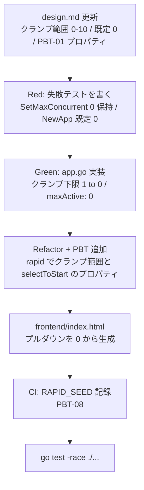

# Workflow Plan — 同時ダウンロード数 0（登録のみモード）

## 変更の性質

| 項目 | 判定 |
|---|---|
| プロジェクト種別 | Brownfield |
| 影響範囲 | 単一コンポーネント（`App` の `maxActive` とフロントエンドのプルダウン） |
| 新規コンポーネント | なし |
| 新規データモデル | なし |
| 外部インタフェース変更 | なし（既存 `SetMaxConcurrent` / `GetMaxConcurrent` の受理範囲拡張のみ） |
| リスク | 低（`selectToStart` は `maxActive == 0` でも既に「何も起動しない」を返す構造） |

## 実行ステージ

### 🔵 INCEPTION

| ステージ | 実行 | 深度 | 理由 |
|---|---|---|---|
| Workspace Detection | ✅ 実行済 | - | 常時実行 |
| Reverse Engineering | ⏭️ スキップ | - | ユーザー判断（Q4）。既存 `requirements.md` / `design.md` を代替とする |
| Requirements Analysis | ✅ 実行済 | standard | 既存要件へ追記 |
| User Stories | ⏭️ スキップ | - | 既存 UI の選択肢に 1 つ値を追加するだけで、新しいユーザーワークフローもペルソナも増えない |
| Workflow Planning | ✅ 実行中 | minimal | 常時実行 |
| Application Design | ✅ 実行 | minimal | `design.md` の `maxActive` 契約（クランプ範囲・既定値・自動補充ルール）を更新する必要がある。PBT-01 のテスト可能プロパティもここで特定する |
| Units Generation | ⏭️ スキップ | - | 単一ユニット（デスクトップアプリ本体）。分解不要 |

### 🟢 CONSTRUCTION（単一ユニット: moviedl-app）

| ステージ | 実行 | 深度 | 理由 |
|---|---|---|---|
| Functional Design | ⏭️ Application Design に統合 | minimal | 新規ビジネスロジックはなく、クランプ範囲と既定値の変更のみ。テスト可能プロパティは `design.md` の「テスト可能プロパティ（PBT-01）」節に記載する |
| NFR Requirements | ✅ 部分実行 | minimal | PBT-09（フレームワーク選定）のみ。Go の PBT フレームワークとして `pgregory.net/rapid` を採用し `design.md` に記録する。性能・スケーラビリティ要件の変化はなし |
| NFR Design | ⏭️ スキップ | - | 新規 NFR パターンの導入なし |
| Infrastructure Design | ⏭️ スキップ | - | インフラ構成なし（ローカル実行のデスクトップアプリ） |
| Code Generation | ✅ 実行 | standard | TDD（Red→Green→Refactor）で実装。例示ベーステスト + PBT の両方を追加（PBT-10） |
| Build and Test | ✅ 実行 | minimal | `go test -race ./...` の実行結果を報告。CI に PBT のシード記録を追加（PBT-08） |

## 変更シーケンス

## 対象ファイル

| ファイル | 変更内容 |
|---|---|
| `aidlc-docs/inception/application-design/design.md` | `maxActive` の契約（0〜10、既定 0）、登録のみモードの節、PBT-01 プロパティ一覧、PBT フレームワーク記録 |
| `app.go` | `NewApp` の `maxActive: 0`、`SetMaxConcurrent` のクランプ下限を 0 に、doc コメント修正 |
| `helpers_test.go` | `selectToStart` の `maxActive == 0` 回帰テスト（例示ベース） |
| `app_test.go` | `SetMaxConcurrent` / `GetMaxConcurrent` の例示ベーステスト |
| `pbt_test.go`（新規） | PBT（`pgregory.net/rapid`）。例示ベーステストとファイルを分離（PBT-10） |
| `go.mod` / `go.sum` | `pgregory.net/rapid` の追加 |
| `frontend/index.html` | プルダウンを `n = 0` から生成 |
| `.github/workflows/ci.yml` | `RAPID_SEED` を記録して再現性を確保（PBT-08） |

## 完了条件

- [x] Application Design（design.md 更新）
- [x] NFR Requirements（PBT-09 フレームワーク選定）
- [x] Code Generation（TDD、例示ベース + PBT）
- [x] Build and Test（`go test -race ./...` 緑）
