# Workflow Plan — m3u8（HLS）対応

要件は [requirements.md](../requirements/requirements.md)「m3u8（HLS）対応」節。
実現可能性の実測根拠は [m3u8-feasibility.md](../requirements/m3u8-feasibility.md)。

---

## 変更の性質

| 項目 | 判定 |
|---|---|
| プロジェクト種別 | Brownfield |
| 要求の種別 | Enhancement（m3u8 の実用化）+ **Bug Fix**（子プロセスの停止漏れ） |
| 影響範囲 | Multiple Components（Go バックエンド 1 ファイル + OS 依存 2 ファイル + フロントエンド） |
| 新規コンポーネント | なし（既存 `App` に純粋関数を追加するのみ） |
| 新規データモデル | なし |
| 外部インタフェース変更 | なし（既存 IPC メソッドのシグネチャは不変） |
| ユーザー可視の変更 | あり（保存ファイル名・登録時の警告・403 のエラー文言） |

## 変更影響の評価

| 影響領域 | 有無 | 内容 |
|---|---|---|
| ユーザー体験 | ✅ あり | 保存ファイル名が変わる（m3u8 のみ）、登録時の警告が増える、403 の説明が変わる |
| 構造・アーキテクチャ | ✅ あり | **プロセスの起動・停止モデルが変わる**（単一プロセス → プロセスツリー） |
| データモデル | ❌ なし | `DownloadItem` のフィールド追加は不要と想定（Application Design で確定） |
| API・契約 | ❌ なし | IPC の追加・変更なし |
| NFR | ✅ あり | セキュリティのみ（引数インジェクション面の拡大・ログの機微情報） |

## リスク評価

| 項目 | 判定 |
|---|---|
| **リスクレベル** | **Medium〜High** |
| ロールバックの容易さ | 容易（コミット単位で分離可能。純粋関数の追加とプロセス停止の変更を別コミットにできる） |
| テストの複雑さ | **Complex**（下記の理由） |

**リスクの所在は 1 点に集中している: プロセス停止方法の変更。**

1. **過去に直した経路に触る。** `CancelDownload` / `PauseDownload` / `ResumeDownload` / `UpdateYtDlp` は
   [design.md](../application-design/design.md) に「ロック内で `item.cmd` を退避してからロック外で
   `Kill` / `suspendProcess`」「一時停止中は resume してから Kill」といった既に踏んだ罠が明文化されている領域。
   [CLAUDE.md](../../../CLAUDE.md)「デグレ防止」の対象そのもの
2. **Windows 実装を開発機（macOS）で検証できない。** 非 Windows はプロセスグループ、Windows は Job Object と
   実装が完全に分かれ、Windows 側は CI のビルド通過しか確認手段がない。**手動確認を Windows 実機で行う必要がある**
3. **停止範囲を広げる変更は「殺しすぎ」の危険がある。** 対象をそのダウンロードのプロセスツリーに正確に
   限定しないと無関係なプロセスに波及する（requirements.md のセキュリティ要件に明記済み）

**リスク低減策:** m3u8 の機能追加（純粋関数中心・低リスク）とプロセス停止の修正（高リスク）を
**別のコミットに分離し、停止の修正を最後に回す**。これにより前者が後者の不安定さに巻き込まれない。

---

## 実行ステージ

### 🔵 INCEPTION

| ステージ | 実行 | 深度 | 理由 |
|---|---|---|---|
| Workspace Detection | ✅ 実行済 | - | 常時実行。既存 aidlc-state.md を検出しレジューム |
| Reverse Engineering | ⏭️ スキップ | - | 要件 1 の判断を継続（既存 `requirements.md` / `design.md` を成果物の代替とする）。加えて今回は対象コードを実測とコード読解で直接特定済み |
| Requirements Analysis | ✅ 実行済 | standard | 実現可能性評価 + Q1〜Q6。既存要件へ追記 |
| User Stories | ⏭️ スキップ | - | 新しいペルソナもユーザーワークフローも生じない。ユーザー可視の変更は「保存名の規則」「警告文の追加」「エラー文言の改善」の 3 点で、いずれも既存フロー内の表示変更。バグ修正部分は再現手順が実測で確定している |
| Workflow Planning | ✅ 実行中 | minimal | 常時実行 |
| Application Design | ✅ **実行** | **standard** | 下記の理由により今回は minimal では足りない |
| Units Generation | ⏭️ スキップ | - | 単一ユニット（デスクトップアプリ本体）。分解不要 |

**Application Design を standard で実行する理由:**

1. **新しい「1 箇所でも漏れたら穴が空く」ルールが生まれる。** プロセスグループ / Job Object への登録は
   `applyOSProcAttr` と `--` 終端と同じ性質のルールになる。design.md に明文化しないと次の人が漏らす
2. **design.md の既存記述に誤りが見つかっている。** 「停止対象は『実行中』だけでは足りない」節は
   yt-dlp プロセスの取りこぼし 3 経路を網羅したが、**孫プロセスを扱っていない**。この節の修正が必要
3. **PBT-01（テスト可能プロパティの特定）を成果物に含める必要がある**（拡張が Full 強制）
4. **ピットフォール記録が [CLAUDE.md](../../../CLAUDE.md) で義務化されている。** 今回判明した
   「ライブ HLS は ffmpeg に委譲される」「SIGKILL では 0 バイトになる」は次の人が確実に踏む罠

### 🟢 CONSTRUCTION（単一ユニット: moviedl-app）

| ステージ | 実行 | 深度 | 理由 |
|---|---|---|---|
| Functional Design | ⏭️ Application Design に統合 | - | 新規のビジネスロジック層はなく、追加されるのは純粋関数と停止手順。要件 1・2 と同じ扱い。PBT-01 のプロパティは design.md の「テスト可能プロパティ（PBT-01）」節に記載する |
| NFR Requirements | ✅ **部分実行** | minimal | PBT-09（フレームワーク選定）は `pgregory.net/rapid` で既に確定済み → 再選定不要。性能・スケーラビリティ要件の変化なし。**セキュリティ要件は requirements.md に確定済み**のため、ここでは新規判断なしを記録するだけ |
| NFR Design | ⏭️ スキップ | - | 新規の NFR パターン（キャッシュ・リトライ・サーキットブレーカ等）の導入がない。セキュリティ要件 5 件はいずれも具体的な実装規則（Referer 値の検証・ログのマスク・停止範囲の限定・エラー文言・フェイルセーフ）であり、論理コンポーネントの設計ではなく **Application Design の design.md に直接書くのが適切** |
| Infrastructure Design | ⏭️ スキップ | - | インフラ構成なし（ローカル実行のデスクトップアプリ。クラウドリソースもデプロイ構成もない） |
| Code Generation | ✅ 実行 | standard | TDD（Red→Green→Refactor）。例示ベーステスト + PBT の両方（PBT-10） |
| Build and Test | ✅ 実行 | standard | `make check`（`gofmt` / `go vet` / `staticcheck` / `go test -race`）+ **Windows 実機の手動確認チェックリスト**（リスク 2 のため今回は minimal にしない） |

### 🟡 OPERATIONS

| ステージ | 実行 | 理由 |
|---|---|---|
| Operations | ⏭️ PLACEHOLDER | 現行の AI-DLC ではプレースホルダー。リリースは従来どおりタグ push で自動ビルド |

---

## 変更シーケンス

**原則: 低リスクで独立した純粋関数を先に固め、高リスクなプロセス停止の変更を最後に単独で行う。**

### Mermaid 図

```mermaid
flowchart TD
    D1["STEP 0: design.md 更新<br/>純粋関数の契約 / 停止の新ルール / PBT-01 / ピットフォール"]
    A1["STEP 1: isM3U8URL<br/>Red to Green to Refactor + PBT"]
    A2["STEP 2: refererFor<br/>オリジン導出と値の検証 + PBT"]
    A3["STEP 3: buildYtDlpArgs 拡張<br/>m3u8 のときだけ referer を付与"]
    A4["STEP 4: m3u8FileName<br/>ホスト + パス要素 + 日時 + PBT"]
    A5["STEP 5: runDownload STEP5 統合<br/>m3u8 は生成名を使う"]
    A6["STEP 6: redactURL<br/>クエリのマスク + PBT"]
    A7["STEP 7: ログ出力の統合<br/>コマンド行と yt-dlp 出力"]
    C1["コミット A: m3u8 の実用化<br/>低リスク・独立"]
    B1["STEP 8: applyOSProcAttr 拡張<br/>プロセスグループ / Job Object"]
    B2["STEP 9: 停止経路の切り替え<br/>Cancel / Pause / Resume"]
    B3["STEP 10: waitProcsDrained<br/>子の終了も待つ"]
    C2["コミット B: 孤児化の修正<br/>高リスク・単独"]
    F1["STEP 11: frontend<br/>登録時の警告 / 403 の説明"]
    T1["make check<br/>gofmt vet staticcheck test -race"]
    T2["手動確認<br/>macOS 実機 + Windows 実機"]

    D1 --> A1
    A1 --> A2
    A2 --> A3
    A3 --> A4
    A4 --> A5
    A5 --> A6
    A6 --> A7
    A7 --> C1
    C1 --> B1
    B1 --> B2
    B2 --> B3
    B3 --> C2
    C2 --> F1
    F1 --> T1
    T1 --> T2

    style D1 fill:#FFA726,stroke:#E65100,stroke-width:3px,color:#000
    style C1 fill:#4CAF50,stroke:#1B5E20,stroke-width:3px,color:#fff
    style C2 fill:#EF5350,stroke:#B71C1C,stroke-width:3px,color:#fff
    style B1 fill:#EF5350,stroke:#B71C1C,stroke-width:2px,color:#fff
    style B2 fill:#EF5350,stroke:#B71C1C,stroke-width:2px,color:#fff
    style B3 fill:#EF5350,stroke:#B71C1C,stroke-width:2px,color:#fff
    style T1 fill:#4CAF50,stroke:#1B5E20,stroke-width:3px,color:#fff
    style T2 fill:#4CAF50,stroke:#1B5E20,stroke-width:3px,color:#fff

    linkStyle default stroke:#333,stroke-width:2px
```



### テキスト版（Mermaid が読めない環境向け）

```
STEP 0  design.md 更新（純粋関数の契約 / 停止の新ルール / PBT-01 / ピットフォール）
          |
   [ コミット A: m3u8 の実用化 — 低リスク・独立 ]
          |
STEP 1  isM3U8URL            Red -> Green -> Refactor + PBT
STEP 2  refererFor           オリジン導出と値の検証   + PBT
STEP 3  buildYtDlpArgs 拡張  m3u8 のときだけ referer を付与
STEP 4  m3u8FileName         ホスト + パス要素 + 日時 + PBT
STEP 5  runDownload STEP5    m3u8 は生成名を使う
STEP 6  redactURL            クエリのマスク           + PBT
STEP 7  ログ出力の統合       コマンド行と yt-dlp 出力
          |
   [ コミット B: 孤児化の修正 — 高リスク・単独 ]
          |
STEP 8  applyOSProcAttr 拡張 プロセスグループ / Job Object
STEP 9  停止経路の切り替え   Cancel / Pause / Resume
STEP 10 waitProcsDrained     子の終了も待つ
          |
STEP 11 frontend             登録時の警告 / 403 の説明
          |
検証     make check（gofmt / vet / staticcheck / test -race）
          |
検証     手動確認（macOS 実機 + Windows 実機）
```

---

## 対象ファイル

| ファイル | 変更内容 | リスク |
|---|---|---|
| `aidlc-docs/inception/application-design/design.md` | 純粋関数の契約、**「停止対象は『実行中』だけでは足りない」節に孫プロセスを追加**、プロセスグループ / Job Object の新ルール、PBT-01 プロパティ、ピットフォール記録 | - |
| `app.go` | `isM3U8URL` / `refererFor` / `m3u8FileName` / `redactURL` の追加、`buildYtDlpArgs` 拡張、STEP5 の名前決定、ログのマスク、`CancelDownload` / `PauseDownload` / `ResumeDownload` / `waitProcsDrained` の停止範囲変更 | **高**（後半） |
| `sysproc_other.go` | `applyOSProcAttr` に `Setpgid` を設定、プロセスグループ単位の停止・サスペンド関数 | **高** |
| `sysproc_windows.go` | Job Object の作成・割り当て、ジョブ単位の停止。既存の `HideWindow` を維持 | **高**（macOS で検証不可） |
| `app_test.go` | 新規純粋関数の例示ベーステスト、停止範囲の回帰テスト | - |
| `helpers_test.go` | 既存ヘルパーに合わせた例示ベーステストの追加 | - |
| `pbt_test.go` | 新規プロパティの追加（現在 16 件 → 増加）。例示ベースとはファイル分離を維持（PBT-10） | - |
| `frontend/index.html` | 同時ダウンロード数 0 での m3u8 登録時の警告、403 のエラー説明 | 低（手動確認） |

**触ってはいけないもの（デグレ防止の明示）:**

- `uniqueDest`（既存ファイルの上書き防止）— 削除・迂回しない
- `-o` のランダム文字列方式 / `-P home:` `-P temp:` の workDir 集約 — `(1)` サフィックス問題の対策
- `--` 終端 と `isValidURL` — 引数インジェクション対策。**Referer も同じ多層防御を通す**
- `--abort-on-unavailable-fragment` — 断片欠損を成功と偽らないための対策
- `shouldRemoveWhenDone` の `"error"` / `"queued"` 残置
- `maxActive == 0` の一般ルール — **m3u8 のための特別分岐を足さない**

---

## 完了条件

- [ ] Application Design（design.md 更新: 契約・新ルール・PBT-01・ピットフォール）
- [ ] NFR Requirements（PBT-09 は既定済み・新規判断なしの記録）
- [ ] Code Generation（TDD。コミット A と B を分離）
- [ ] Build and Test
  - [ ] `make check` が緑（`gofmt` / `go vet` / `staticcheck` / `go test -race ./...`）
  - [ ] SECURITY コンプライアンス表に blocking findings がない
  - [ ] PBT コンプライアンス表に blocking findings がない
  - [ ] **macOS 実機の手動確認**（m3u8 のダウンロード / 保存名 / キャンセルで ffmpeg が残らないこと）
  - [ ] **Windows 実機の手動確認**（同上 + yt-dlp 更新時の実行ファイル置換が成功すること）

## 規模の見積もり

時間ではなく TDD サイクル数で示す（実装量の目安）。

| 区分 | サイクル数 |
|---|---|
| コミット A（m3u8 の実用化） | 純粋関数 4 件 + 統合 3 件 = **約 7 サイクル** |
| コミット B（孤児化の修正） | OS 依存 2 件 + 停止経路 3 件 = **約 5 サイクル** |
| フロントエンド | 自動テスト対象外（手動確認 2 経路） |
| 合計 | **約 12 TDD サイクル** |

## 成功条件

- **主目的**: インターネット上の m3u8 URL を登録して、**中身が判別できるファイル名で**ダウンロードできること
- **副目的**: キャンセル・一時停止が ffmpeg まで確実に効くこと（孤児プロセスが残らないこと）
- **品質ゲート**: `make check` 緑 / SECURITY・PBT ともに blocking findings なし / 両 OS の手動確認完了
